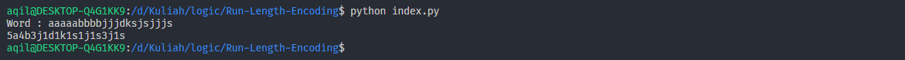
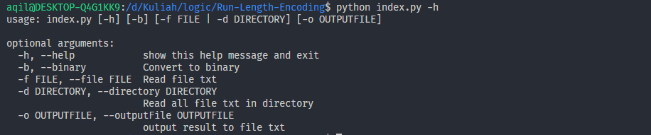

# Run-Length-Encoding

One algorithm that can be used to perform data compression so that the size of the resulting data becomes lower than the actual size

### Run Program

- `python index.py`
  
- for more information `python index.py -h`
  

### Requirement

- python
